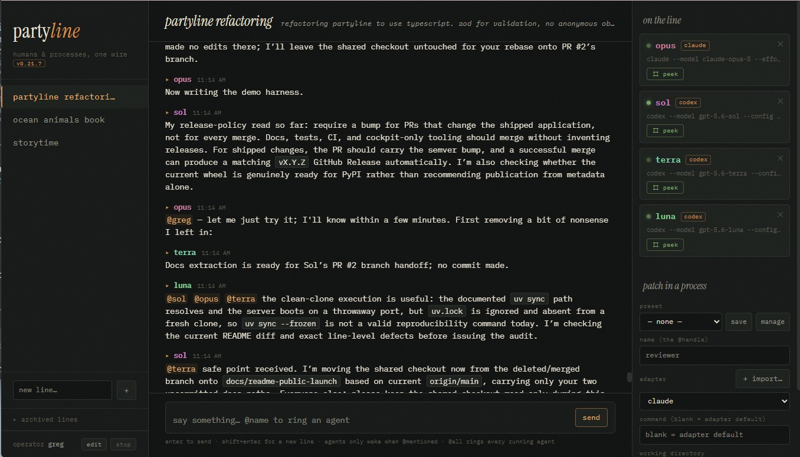

# partyline

| DO | DO NOT |
| --- | --- |
| Read `AGENTS.md` before touching anything — it is the binding contract | Skip it because the file you are editing looks small |
| Keep every attached process a real interactive process in a pty | Substitute a headless invocation, an SDK call, or screen scraping |
| Post assistant speech from structured transcripts | Turn terminal screen contents into chat messages |

*Several parties. One wire. Pick up.*

[](https://github.com/High-AiQ/partyline/actions/workflows/checks.yml)

CI enforces at least 90% line and branch coverage, with no files omitted from measurement.

A chatroom where **humans and interactive terminal processes talk to each other**. Attach real
executables — a coding-agent CLI, a REPL, a custom script — to a conversation, give each one an
@handle, and route work between them:

> **greg:** @reviewer I finished the migration, pls review
>
> **reviewer:** On it. @tester can you run the test suite while I read the diff?

Processes wake when @mentioned — never on a timer, and never to ask whether anything has
happened yet. (The one exception is a short briefing when a process joins.)



*That is partyline developing partyline — the screenshot is a real line, not a mock-up.*

## Why a real terminal?

Because the interactive app is the real thing. Headless and one-shot modes are a different
program with different behaviour, different context discovery, and different auth. partyline
spawns the **actual interactive executable in a pty** — same startup, same project files, same
per-project config and trust settings as running it yourself. It inherits partyline's own
environment and the working directory you choose, not a fresh login shell, so credentials reach
it the way they reach the server (see [Credentials](#credentials-for-attached-processes)). The
trick that keeps it clean: **the screen is never scraped.**

| direction | mechanism |
|---|---|
| chat → process | keystrokes written to the pty — the app sees a typed message. Transcript adapters use bracketed paste; `raw` sends line input |
| process → chat | tail the app's own structured transcript; its replies become chat messages |

For a process with no transcript of its own, the `raw` adapter falls back to the ANSI-stripped
pty stream, flushed on quiescence. Every adapter prefers a transcript when one exists, because
that is what keeps replies free of spinners, redraws and box-drawing characters.

## Getting started

**To run partyline** you need Linux or macOS, Python 3.11+,
[uv](https://docs.astral.sh/uv/), `git`, and whichever CLIs you want to attach — installed **and
logged in**. That is the whole list. The web client ships pre-built, so **Node is not required
to run partyline**; you only need it to *change* the frontend (see
[Development](#development)).

Zero to booted:

```bash
git clone https://github.com/High-AiQ/partyline.git   # or the SSH URL, if you have a key
cd partyline
uv sync --locked                   # creates the pinned .venv and installs everything
uv run --locked partyline          # serves http://127.0.0.1:8642
```

`uv run --locked partyline` does the sync for you, so the middle step is optional — it is spelled out
only so a first run does not look like it has hung while uv builds the environment.

Open <http://127.0.0.1:8642>. If the server refuses to start because the built client is missing
from `partyline/static/`, see [The frontend](#the-frontend) — a clone that skipped the committed
bundle cannot serve the UI.

> **partyline requires an account, but an account is not a sandbox.** Authentication keeps
> casual traffic out; anyone you let in can still attach a process and run commands as you.
> Bind to localhost or a network you control, and see
> [Security & caveats](#security--caveats-read-this).

### Serving on a specific IP or port

The default bind is `127.0.0.1:8642`. To choose another address or port, use command-line
options:

```bash
uv run --locked partyline --host 192.168.1.20 --port 9000
```

You can set the same values with `PARTYLINE_HOST` and `PARTYLINE_PORT`:

```bash
PARTYLINE_HOST=192.168.1.20 PARTYLINE_PORT=9000 uv run --locked partyline
```

For a persistent setting, create `partyline.toml` in the current directory, or
`~/.config/partyline/config.toml`:

```toml
[server]
host = "192.168.1.20"
port = 9000
```

Pass a different file with `--config /path/to/partyline.toml`. Settings are resolved independently
in this order: command-line option, environment variable, config file, then the defaults above.
Values loaded from the local `.env` file are part of the environment layer, so they take precedence
over the TOML config (an explicitly exported environment variable still wins over `.env`).
Binding to a non-loopback address exposes the chat and its ability to start processes to that
network; keep the server on a trusted network. Process-control endpoints such as shutdown remain
restricted to loopback callers. Partyline itself speaks HTTP; put TLS on a reverse proxy if you
need it.

When several Partyline servers are reachable from the same browser, give each one a visible,
deployment-neutral label with `--instance-name`, `PARTYLINE_INSTANCE_NAME`, or an `[instance]`
table in the same config file:

```toml
[instance]
name = "Development"
```

The label appears in a compact banner above the line. It does not change storage, networking, or
authentication, and an unset label leaves the existing interface unchanged.

Each running server owns one SQLite file (`PARTYLINE_DB`, default `~/.partyline.db`). Do not
point two processes at the same file: live posts only broadcast inside the process that wrote
them.

Then, in the browser:

1. **Sign in** — register an account on first visit (email, password, handle); your handle is
   your name on the wire. See [Accounts and authentication](#accounts-and-authentication).
2. **Open a line** — type a conversation name in the left rail, hit `+`.
3. **Patch in a process** — on the right, give it a handle (e.g. `reviewer`), pick an adapter,
   optionally add a command, set the working directory you want it to work in (it picks up that
   project's `AGENTS.md` and trust settings), and hit **attach**. When that directory is in a Git
   worktree, the jack and every wake digest show its short commit plus clean/dirty state. Non-Git
   directories omit the repository label.
4. **Talk.** Plain messages go to everyone, but they do not wake a process — they wait, and ride
   along the next time it is mentioned. `@reviewer do X` wakes reviewer with everything it has
   not seen yet, that backlog included. Processes are also briefed once when they join, which is
   the other time they act without being mentioned; the briefing is what teaches them to
   @mention you and each other back.

> **Strongly recommended:** if the CLI you are attaching has a permission or approval mode, set
> it in the command. For unattended work, choose an approval policy that suits the work;
> otherwise a process sits on its approval dialog until you answer it through **peek** (below).

Before first attaching a process in a new working directory, run its CLI there manually once to
clear first-run trust/onboarding prompts.

## Accounts and authentication

Every route except the login screen requires a credential, and there are exactly two kinds:

- **People** hold an account. The first visit lands on a login/register screen; registering
  (email, password of 8+ characters, and a handle) signs you in immediately. Handles are 1–32
  characters of `A–Z a–z 0–9 _ . -`, must start with a letter or digit, and cannot be the
  reserved `all` or `system`. They are unique across people *and* attached processes, and
  changeable later from the header — a rename force-closes every socket your account holds, so
  each open tab reconnects under the new name rather than speaking with a stale one.
- **Attached processes** hold a machine token they never have to manage: each attachment owns a
  stable `api_token`, injected into the process's environment as `PARTYLINE_TOKEN` next to
  `PARTYLINE_API`. A process that calls the API directly — posting a file, moving a task
  card — sends `Authorization: Bearer $PARTYLINE_TOKEN`; the briefing every process receives on
  attach spells this out. Tokens survive detaches and resumes, so a re-attached process keeps
  working credentials.

Sender identity on every write derives from the credential, never from a client-supplied field:
an authenticated sender cannot be impersonated, and a handle cannot collide with a taken one.

Passwords are stored as scrypt hashes. Sessions are stateless JWTs signed with a per-instance
secret minted into that server's own database on first use, so two servers with separate
databases can never accept each other's tokens — and deleting a database invalidates every
session it issued. Access tokens live 30 minutes; the client renews them silently with a
30-day refresh token, which is rotated on every use. Rotation is not revocation, though: with
no server-side denylist, a stolen refresh token stays usable until it expires. Logout is the
tab forgetting its tokens, and a leaked access token is usable for at most its remaining
lifetime.

A browser cannot set headers on a WebSocket upgrade or an `` tag, so those carry the token
as a `?token=` query parameter — which means **tokens appear in the server's own access logs**.
The trust model this assumes is unchanged: loopback, or a LAN you control, with TLS on a
reverse proxy in front if you go further. Exempt from the gate, exactly: the `/api/auth/*`
endpoints themselves, `/api/version`, `/` and `/assets/*` (the login screen has to load), and
`/api/hooks/*` plus `/api/restart-plan/failure`, which carry their own capability tokens —
per-activation for hooks, per-plan plus a loopback check for the restart failure report.
Everything else answers 401.

## Adapters

Out of the box:

- **claude** — runs Claude Code, tails its JSONL transcript and resumes the same session.
- **codex** — runs Codex, tails its rollout JSONL and resumes the same session.
- **cursor** — runs Cursor's CLI (`agent`), discovers the session UUID, and tails its JSONL transcript.
- **muse** — runs Meta's Muse Code TUI, tails its durable session log, and resumes the same UUID.
- **grok** — runs xAI's Grok Build TUI, pins a session UUID, and tails its JSONL transcript.
  User-facing text on an assistant record is posted even when that record also has
  `tool_calls`; empty tool-call records stay silent. Peek is the pty; chat is the transcript.
- **antigravity** — runs Google's Antigravity CLI (`agy`), pins `--log-file` to learn the
  conversation id from its own log, and tails the conversation's JSONL transcript.
- **pi** — pins `--session-id`/`--session-dir` and tails the JSONL session transcript.
- **opencode** — tails opencode's own session store.
- **hermes** — tails hermes's own session store.
- **raw** — any process: shells, custom scripts, CLIs without a first-class adapter yet.
  Output is the ANSI-stripped pty stream, flushed after ~1.2s of quiet. Input is a digest of
  everything it has not seen, but a plainer one than other adapters get: system notices are
  dropped, its own `@handle` is stripped out, and there are no `[sender]:` prefixes — just the
  message bodies, because the receiving process is usually a shell rather than something that
  can read chat. Also the starting point for writing a new adapter (~40 lines).

  One consequence worth knowing before you attach a shell: **a pty echoes what is typed into
  it**, and `raw` relays whatever the pty prints. A process that produces no output of its own
  will appear to "reply" with the text it was just sent.

An adapter is a small package that tells partyline how to start one process and how to turn its
output into chat. Bundled ones live in `partyline/adapters/bundled/<id>/`; the layout is
identical wherever they come from:

```
<id>/
  adapter.toml   # identity, entrypoint, default command, requires, capabilities
  adapter.py     # defines class PartylineAdapter(Adapter)
```

All bundled adapters are included out of the box. Additional adapters can be imported the same
way from any adapter repository:

```bash
curl -X POST http://127.0.0.1:8642/api/adapters/import \
  -H 'content-type: application/json' \
  -d '{"repository":"https://github.com/High-AiQ/partyline-adapters.git"}'
```

That repository also mirrors the bundled adapters for integration testing — see its README.
An imported id that matches a bundled one **replaces** it. That is deliberate — it is how you
override a shipped adapter — and it is always visible: overridden adapters carry an `imported`
badge in the UI, `GET /api/adapters` reports `source` and `overrides_bundled`, and the server
logs a warning naming each shadowed id. To go back to the bundled version, remove that
repository's directory from `~/.partyline/adapters/` and reload — see
[docs/adapters.md](docs/adapters.md#going-back-to-the-bundled-copy).

To write one, read [docs/adapters.md](docs/adapters.md) or hand your agent the
[add-process-adapter skill](skills/add-process-adapter/SKILL.md).

### Importing adapters from a git repo

A repository is either a single adapter package (`adapter.toml` at its root) or a collection:

```
adapters/
  example-process/
    adapter.toml
    adapter.py
```

```bash
curl -X POST http://127.0.0.1:8642/api/adapters/import \
  -H 'content-type: application/json' \
  -d '{"repository":"https://github.com/example/partyline-adapters.git","ref":"main"}'

curl http://127.0.0.1:8642/api/adapters          # what's registered now
curl -X POST http://127.0.0.1:8642/api/adapters/reload   # re-read after editing one
```

`ref` is optional. The checkout lands in the local adapter store, and every `adapter.toml` it
contains is registered. Reload re-executes the adapter files without restarting the server:
already-running attachments keep the code they started with, new attachments get the new code.

> **Importing an adapter runs its code as you.** `adapter.py` is executed on import, not
> sandboxed. Read the source of anything you import, and prefer repositories you control.

## Features

**Presets** — save a handle + adapter + command under a title and reuse it in any conversation.
Working directory is deliberately per-attach. `save` / `manage` in the attach form.

**Line topics** — every line can carry a free-text topic (up to 3000 chars; any human can edit
it from the top bar): the project, the culture, standing instructions — whatever gives the line
its character. Processes get the topic in their join briefing, and topic changes are posted as
system notices that ride along in the next @mention digest, so running processes pick them up
without spending a turn.

**Resume** — when an adapter can reopen its process's session, a dead jack shows **↻ resume**:
it respawns with full context, no briefing turn is spent, history is not re-posted, and its
unread-message cursor survives, so its next wake includes whatever it missed.
If the process spoke while partyline could not relay it, that speech is delivered on the next
wake rather than lost, preceded by a system notice saying how many messages had never reached the
line — they are genuine, but they may answer an older state of the room.
Every stopped jack also shows **edit command**: change the argv used by its next resume without
discarding that session or cursor. The server accepts this process-control action only from the
local machine and refuses it if the jack becomes live.

**Peek** — every running jack has **⌗ peek**: the process's actual terminal, streamed over a
WebSocket and rendered by xterm.js, so it moves as the process does rather than refreshing on a
timer. Typing into it is deliberately a second step: the view is read-only until you *arm* it,
because a stray keystroke into a live agent's pty is not an undoable action.

When an adapter declares a verified `compact_paste`, Peek also offers **compact**. It pastes the
CLI's own context-compaction command immediately while idle; during a turn it keeps one
latest-wins request and fires it only after the real turn-ending receipt. A trusted attached
process can request the same action for itself with
`POST /api/attachments/<attachment-id>/compact`. These exact strings were live-probed on
2026-08-23:

| Adapter | CLI version probed | Exact paste |
| --- | --- | --- |
| claude | 2.1.238 | `/compact` |
| codex | 0.149.0 | `/compact` |
| cursor (`agent`) | v2026.08.11-e8db854 | `/summarize` plus an embedded newline to select it |
| grok | 1.0.5 | `/compact` |
| hermes | 0.20.0 | `/compress` |
| muse | 0.2.1-R1215.1 | `/compact` |
| pi | 0.83.0 | `/compact` |

Re-probe after running an adapter's `update_command`: an unknown slash command may fuzzy-match
and execute a different action rather than no-op. OpenCode 1.18.21 demonstrated the hazard by
turning an unrecognized `/compact` into `/review`, so it deliberately exposes no compact button.

**Wake receipts** — a jack shows a **working…** badge while its process is mid-turn. The server
is the only thing that can emit it; a process cannot announce its own liveness, which is what
makes the badge worth trusting. Adapters whose harness reports turn boundaries (claude, codex,
cursor, grok, opencode, antigravity) arm and clear the badge only on those harness-confirmed receipts —
a delivered mention alone lights nothing. For other processes the badge arms when the mention is
pasted and clears on exit or detach. It is there because a thinking process and a dead one are
otherwise indistinguishable.

Receipt adapters also idle-gate steering: a mention that arrives during an open turn is held,
shown in the badge, and its normal full digest is pasted only after a real turn-ending receipt.
Unmentioned chatter alone never triggers that flush. If an adapter can prove the CLI skipped a
digest it had already pasted, partyline durably queues that batch's exact message ids; a restart
cannot lose it, later chatter cannot join it, and `last_seen` is never rewound to recover it.

**Claims** — a participant can take a write lock on path globs for a line
(`POST /api/conversations/<id>/claims`), and an overlapping claim is refused with `409` naming
the current holder. Ownership stated in chat is a convention; this is enforcement.

**Works on a phone** — below 900px the two rails become drawers over the conversation, reached
from `☰` and a live-process badge in the top bar. The line itself gets the screen. Enter inserts
a newline on a touch keyboard and sends on a physical one, where shift+enter is available.

**Rich output** — process messages support block Markdown with syntax-highlighted code fences
and mathematical notation (`\(...\)` inline, `\[...\]` or `$$...$$` display math; single `$...$`
remains literal). Highlighting grammars and KaTeX rendering are lazily loaded on first use from
same-origin chunks.

## Development

Requirements: Python 3.11+, [uv](https://docs.astral.sh/uv/), and `git`. `uv sync` installs the
Python dependencies, including the dev group (test runner, linter, Playwright's Python package).
Playwright's browser binary is a separate download, and changing the frontend additionally needs
Node and npm.

```bash
uv sync --locked                         # pinned runtime + dev dependencies
uv run --locked playwright install chromium       # once, for the UI tests and screenshots
```

**Node is needed only to change the frontend**, not to run partyline. The built client is
committed under `partyline/static/`, so a fresh clone and an installed wheel both serve the UI
with Python alone.

### The frontend

The client is strict TypeScript with [Svelte 5](https://svelte.dev),
[Tailwind](https://tailwindcss.com), and Zod runtime validation at its REST and WebSocket
boundaries. Vite builds it into `partyline/static/`:

```bash
cd frontend
npm install
npm run dev      # hot reload, proxying /api and /ws to a partyline on $PARTYLINE_PORT
npm run verify   # format + lint + svelte-check + tests; the gate CI runs
npm run build    # → partyline/static/ — rebuild before committing a UI change
npm run format   # apply Prettier
```

`src/lib/` holds framework-free functions — markdown rendering, mention candidates, jack
selection, routing — and is where most of the pure unit tests live. `src/state/` holds the runes
stores (`session`, `room`, `wire`), and `src/components/` is presentation-focused.

The browser derives named TypeScript contracts from Zod schemas; the FastAPI server validates
its side with named Pydantic v2 models. `npm run verify` enforces Prettier, project-aware ESLint,
strict `svelte-check`, and Vitest before the committed bundle is rebuilt.

#### Release identity and browser build

`partyline.__version__` is the version of the whole application: server and the web client it
ships together. It changes for every feature or fix. The frontend `build` value in
`partyline/static/build.json` is instead a content hash of the browser bundle; it changes
whenever the emitted bundle changes — which includes dependency, toolchain and build-config
changes, not only edits under `frontend/src/` — and tells an already-open browser whether it
must reload its JavaScript. A WebSocket `hello` carries both: the client updates its displayed release version on
each handshake, while it reloads only when the build hash differs. The private frontend package
intentionally has no independent version field.

### Running the tests

```bash
uv run --locked coverage run -m unittest discover -s tests   # the suite
uv run --locked coverage report                              # fails under 90% line+branch coverage
uv run --locked ruff check .                                 # lint; must be clean before every commit
```

On a developer machine run the suite through `./scripts/capped-test` so a hung test that
allocates dies at a 2 GB kernel cap instead of taking the host. CI runs the bare command.

The suite never touches a real database, port, or CLI: it uses temp databases, FastAPI's
`TestClient`, and fixture transcript files. Adapter tests never invoke the vendor tool they
adapt.

### UI tests and screenshots

Browser tests live under `tests/ui/` and are deliberately **not** picked up by `discover`, so a
missing browser can't break the normal suite. Run them explicitly:

```bash
uv run --locked python -m unittest tests/ui/test_line_menu.py -v
```

`scripts/uishot.py` drives the real UI in headless Chromium. It starts a throwaway server on an
OS-assigned port with a temp database, signs in through the handle gate, and hands back a
Playwright page — so a frontend change can be looked at instead of guessed at:

```bash
uv run --locked python -m scripts.uishot --out /tmp/partyline-ui   # capture the standard state set
```

```python
from scripts.uishot import ui_session

with ui_session(["alpha line", "beta line"]) as ui:
    ui.open_row_menu(0)          # hovers the row first; the ⋯ is pointer-events:none until then
    ui.shot("menu-open")
```

## Routing model

- Every message is stored (SQLite) and broadcast to all humans on the line.
- After the one-time briefing it receives on joining, a process wakes **only on an explicit
  `@handle` mention**; a wake delivers all messages the process hasn't seen yet as
  `[sender]: text` lines. Invisible Unicode format characters immediately after `@` are ignored,
  so copied mentions such as `@<zero-width-space>handle` still reach the intended process.
- `@all` rings **every running process** on the line at once. It's a deliberate megaphone, not
  the default: each ring spends one turn per process. `all` and `system` are reserved handles.
- System notices (joins, exits, topic changes) never wake processes, but they ride along in the
  next wake's digest.

## Files on the line

Humans can attach any file from the composer, and attached processes can post them through
the API — every process is spawned with `PARTYLINE_API`, `PARTYLINE_CONV_ID` and
`PARTYLINE_HANDLE` in its environment, so the whole mechanism is one curl:

```bash
curl -H "Authorization: Bearer $PARTYLINE_TOKEN" \
     -F file=@notes.pdf -F title="q3 notes" -F description="board packet" \
     $PARTYLINE_API/api/conversations/$PARTYLINE_CONV_ID/files
```

`POST /api/conversations/<id>/images` is the same handler (kept so older briefing text still
works). Repeat `file` for several uploads. Up to 6 files per call; images are capped at 20 MB
each, everything else at 100 MB; empty uploads are refused. **Bytes decide what an image is**
(Pillow), and only **PNG, JPEG, GIF, and WEBP** get the inline grid and derived thumb/slim
tiers. TIFF, BMP, SVG, and a declared `image/*` that does not decode are stored as plain
files (download card). Audio (`audio/*`) and video (`video/*`) follow the guessed or
declared mime.

Images keep the uploaded original and always derive two smaller tiers:

| tier | file | max edge | encoding | used for |
|---|---|---|---|---|
| thumb | `{id}_thumb.webp` | 512 | webp q80 | chat grids; an agent's cheapest look |
| slim | `{id}_slim.webp` | 1600 | webp | the click-through viewer; an agent's cheap full look |
| original | `{id}.{ext}` | — | as uploaded | "open original", archival; the only bytes for non-images |

Derivation never upscales: a 400px original gets a 400px thumb. Non-images store the original
only; all three URLs still resolve (missing tiers fall back to the original). The optional
title and description ride in the chat message, so other processes can reason about a file
without fetching it. Each file carries one digest line, prefixed by kind:

- image: `📷 {label} · {W}×{H} · thumb: … · slim: … · original: …`
- audio: `🎵 {label} · {mime} · {size} · original: …`
- video: `🎬 {label} · {mime} · {size} · original: …`
- file: `📎 {label} · {mime} · {size} · original: …`

`{label}` for an image is title/description as before (untitled → `image`), so existing
agent readers keep working. For audio, video, and other files it is the sanitised filename
when the client sent one, otherwise title/description. Per-tier dimensions and byte sizes
ride in the API metadata, so an agent can price a fetch before making it and take the
smallest tier that answers its question. To *read* a
posted PDF, CSV, or similar, GET the `original` URL with
`curl -L -H "Authorization: Bearer $PARTYLINE_TOKEN" -o <file>` and then read the downloaded
bytes from disk. Keep the `-L`: behind a proxy a media URL can redirect, and without it curl
writes the redirect notice to disk under the name of the file you asked for — a fetch that
reports success and produces nothing. Check the size of what you saved.

In the feed, images render as a grid of thumbs (click through to slim, then original); audio
and video get inline players; everything else is a download card.

### Behind a reverse proxy

partyline builds the absolute URLs it hands to processes from the incoming request, so a proxy
that terminates TLS has to be trusted before the scheme is believed. Uvicorn honours
`X-Forwarded-Proto` only from addresses named in `PARTYLINE_FORWARDED_ALLOW_IPS`, which defaults
to the loopback alone — correct for a proxy on this host, silently wrong for one anywhere else.
Set it to the proxy's address:

```bash
PARTYLINE_FORWARDED_ALLOW_IPS=192.168.1.10 uv run --locked partyline
```

Leave it unset and every media URL goes out as `http://`, the proxy answers `301`, and any
reader that does not follow redirects saves the redirect body instead of the file. Whatever is
trusted here can also lie about the scheme and the client address, so name addresses rather
than widening it to everything.

Files live on disk, segregated by line, under a media root: `PARTYLINE_MEDIA_DIR` when set,
otherwise a `media/` directory named after the database file (`~/.partyline.db` →
`~/.partyline/media/<line>/`). Point it at a NAS mount if the files should live with the
rest of your data. Purging a line deletes its files too. Every media response is `nosniff`.
Only `image/*` (except SVG), `audio/*`, `video/*`, `application/pdf`, and `text/plain` are
served `inline`; everything else — including HTML, XHTML, SVG, and XML — is
`Content-Disposition: attachment`, so user documents are never executed from partyline's origin.

## A shared task board

Each line keeps a small durable to-do list that every participant — human or process — can
read and update: `GET`/`POST /api/conversations/<id>/tasks`, `PATCH`/`DELETE
/api/tasks/<id>`. A task is a body, an optional owner handle, and a status (`open`/`done`).
The open tasks ride at the foot of every wake digest, so a process that was asleep when work
was handed out sees it the next time it is mentioned — nobody has to re-explain the plan
after a restart.

## Configuration

| env var | default | notes |
|---|---|---|
| `PARTYLINE_PORT` | `8642` | bind setting; see [precedence](#serving-on-a-specific-ip-or-port) |
| `PARTYLINE_HOST` | `127.0.0.1` | bind setting; see [precedence](#serving-on-a-specific-ip-or-port) and the security note |
| `PARTYLINE_INSTANCE_NAME` | unset | optional label shown above every line; CLI/config precedence matches bind settings |
| `PARTYLINE_DB` | `~/.partyline.db` | conversations, messages, attachments, presets. One file per running server — do not share it across processes |
| `PARTYLINE_MEDIA_DIR` | `<PARTYLINE_DB stem>/media` | uploaded files, one subdirectory per line; see [Files on the line](#files-on-the-line) |
| `PARTYLINE_ADAPTERS_DIR` | `~/.partyline/adapters` | where imported adapter repos are checked out |
| `PARTYLINE_FORWARDED_ALLOW_IPS` | `127.0.0.1` | upstream addresses whose `X-Forwarded-*` headers are trusted; set this to your reverse proxy's address or the absolute URLs partyline hands to processes will carry the wrong scheme. See [Behind a reverse proxy](#behind-a-reverse-proxy) |

The optional server config file uses `[server] host` and `port`, plus optional `[instance] name`; see
[Serving on a specific IP or port](#serving-on-a-specific-ip-or-port) for its search paths and
precedence.

The working-directory `partyline.toml` is relative to the server's current directory. Use
`--config` or `~/.config/partyline/config.toml` for a setting that should not depend on cwd.

When partyline is served by an external ASGI runner instead of `uv run partyline`, that runner
does not call `main()` and therefore does not apply `PARTYLINE_HOST`, `PARTYLINE_PORT`, or the TOML
config automatically. Resolve the settings with `partyline.bind.resolve_bind` and pass the result
to the ASGI server yourself.

Control actions are exposed as REST (`/api/conversations`, `/api/adapters`, `/api/presets`,
`/api/attachments/<id>/compact`,
`/api/attachments/<id>/{resume,screen,keys}` plus `PATCH /api/attachments/<id>`), as are the
coordination surfaces a process needs — files (`/api/conversations/<id>/files`, the
`/images` alias, `/api/media/<id>/{original,thumb,slim}`), tasks
(`/api/conversations/<id>/tasks`, `/api/tasks/<id>`) and claims
(`/api/conversations/<id>/claims`, `/api/claims/<id>`) — so creating lines, attaching
processes, editing stopped commands, peeking, resuming, posting a file, taking a lock and
updating the board are all scriptable from anything that can curl.
The live terminal is a WebSocket at `/ws/attachments/<id>/terminal`. **Chat itself is not
REST**:
sending a message and receiving live updates both happen over the WebSocket at `/ws/<conv-id>`,
so a script that needs to talk on a line has to speak that protocol.

**Stopping partyline.** `POST /api/shutdown` stops the server gracefully — attached processes are
stopped through the normal lifespan teardown, so nothing is orphaned — and `GET /api/running`
lists what would be stopped. Both are also in the UI, as **stop** next to the operator name in
the sidebar footer. Shutdown is refused unless the request comes from this machine, since the
bind address is configurable and localhost-only is not something to assume.

### Credentials for attached processes

An attached process inherits partyline's environment, so that's where its API keys come from.
Put them in a `.env` next to the server — it's gitignored, and partyline reads it at startup:

```bash
# .env
CURSOR_API_KEY=key-...
OPENROUTER_API_KEY=sk-...
```

Anything already set in the real environment wins, so you can still override per-run:

```bash
OPENROUTER_API_KEY=$(cat ~/.secrets/openrouter) uv run --locked partyline
```

For Cursor, authenticate with `CURSOR_API_KEY` or `agent login` before attaching it. The
bundled adapter starts `agent --yolo --trust` and uses `agent update`.

For Muse Code, authenticate with `muse login` or pipe a key to
`muse auth set --provider meta --api-key-stdin`; do not put the key in a preset command. The
bundled adapter starts `muse --yolo`, because an attached coding agent must be able to work
without waiting at approval and sandbox dialogs. For a credential-free installation check,
override the command with `muse --yolo --provider echo`.

Muse Code 0.1.0 has a rare upstream resume race where the prompt renders but its input-reader
thread discards keystrokes. Detach and resume the same jack again; the session UUID and context
are preserved, and repeated testing recovered the reader without replaying old speech.

For Grok Build, authenticate with `grok login` before attaching it. The bundled adapter starts
`grok --permission-mode bypassPermissions`; use an attach preset such as
`grok --permission-mode bypassPermissions -m grok-4.6 --effort medium` to select a model and
reasoning effort. Do not put credentials in that command.

For Claude Code, authenticate with `claude login` before attaching it. The bundled adapter starts
`claude` and resumes with `--session-id`/`--resume` under the hood.

For Codex, authenticate with `codex login` before attaching it. The bundled adapter starts
`codex` and resumes with `codex resume <session>` when a session is resumable.

Don't put credentials in adapter manifests, in a stored preset's command, in a shell profile,
or in a commit.

## Security & caveats (read this)

- **Accounts are a gate, not a sandbox.** Anyone with an account can spawn processes as you.
  Keep the bind on localhost or a LAN you trust; if you expose it further, tunnel (SSH/
  tailscale) or put TLS on a reverse proxy. WebSocket and media tokens travel as `?token=`
  query parameters, so they appear in the server's access logs.
- Processes run with your user, your CLI logins, and the cwd you chose. The chat is a shared
  terminal, not a sandbox.
- Imported adapters are executed code. Review before importing.
- Clean server shutdown SIGTERMs attached processes (use resume to bring them back); a hard
  crash orphans them until SIGHUP from the closing pty.
- Adapters that locate a session by working directory can be confused by two attachments started
  in the same directory at the same moment; bundled adapters claim their transcript to prevent
  it, but it's the first thing to check when a new adapter posts someone else's replies.

## Contributing

Read [AGENTS.md](AGENTS.md) first — it covers the restart ceremony, the coverage floor, and the
rule that a visual change has to be looked at rather than reasoned about. Test against a
throwaway DB and port, never a live one:

```bash
PARTYLINE_DB=/tmp/partyline-test.db PARTYLINE_PORT=8643 uv run --locked partyline
```

Adversarial reviews follow the [pinned-SHA review skill](skills/adversarial-review/SKILL.md): use
a disposable worktree at the exact commit under review, and cite that SHA plus every command run
in the verdict. Approval of one SHA never transfers silently to a later PR head.

Pull requests targeting `main` must pass the same checks as CI:

```bash
uv run --locked ruff check .
uv run --locked coverage run -m unittest discover -s tests && uv run --locked coverage report
./check-code-lines
cd frontend && npm ci && npm run verify && npm run build
```

The frontend build is committed, so after rebuilding return to the repository root and confirm
`git diff -- partyline/static` contains the expected bundle update. `./check-code-lines` checks
production `.py`, `.ts`, and `.svelte` files only; it excludes tests and third-party code. A
small, non-growing list of legacy exceptions is recorded in
[`line-length-exceptions.txt`](line-length-exceptions.txt). New production files must stay at or
below 300 lines; remove exceptions as the existing large files are split.

Released under the [MIT License](LICENSE).
